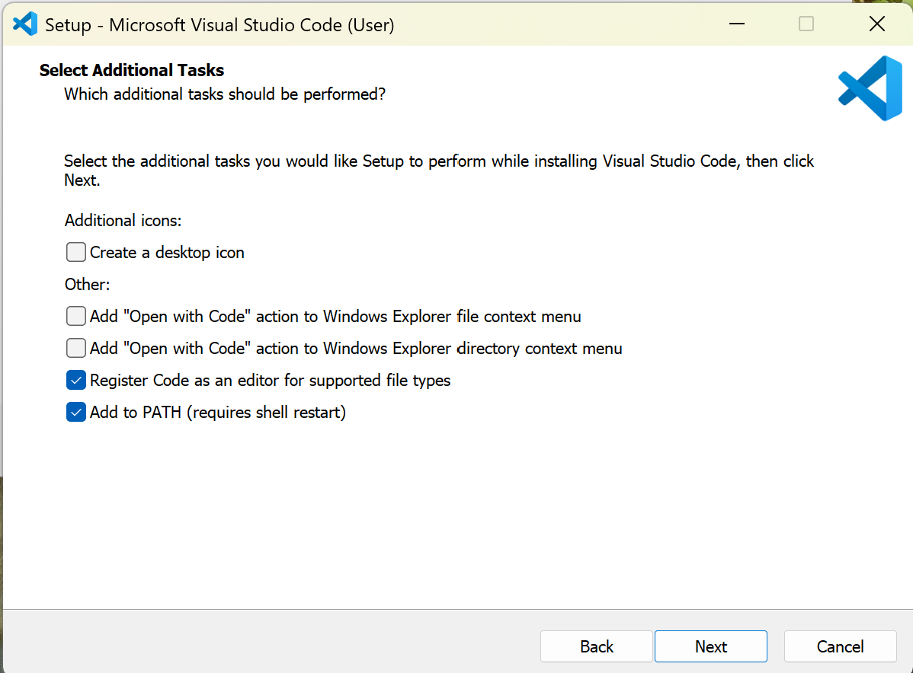
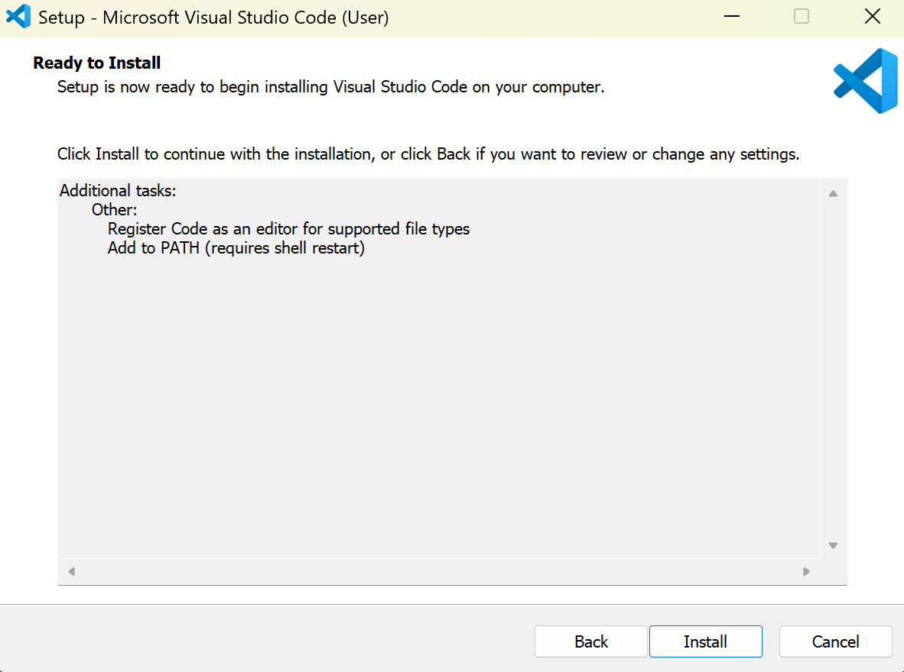
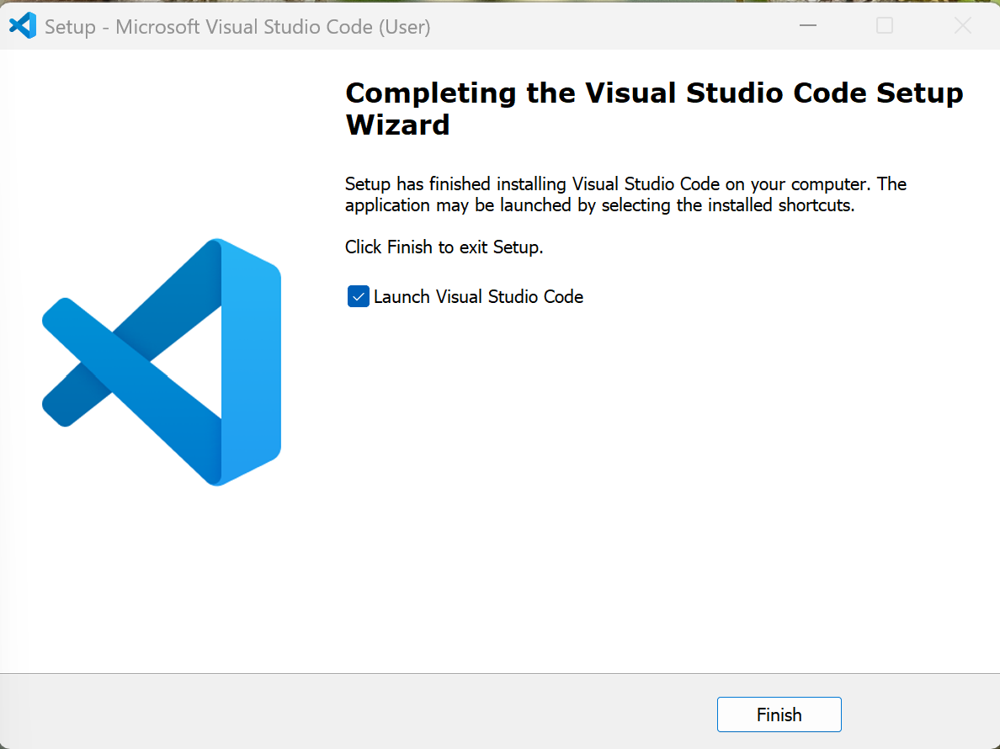

# 🧭 Project Overview

This repository documents the **Visual Studio Code installation process** on Windows, with an emphasis on verifying that the `code` command is successfully added to the system PATH.  

The guide includes step-by-step screenshots to help users:
- Install VS Code correctly on Windows systems  
- Enable the `code .` command for launching projects directly from the terminal  
- Avoid common PATH and shell configuration errors during setup  

By following this guide, you’ll ensure Visual Studio Code integrates smoothly with your developer workflow, whether for AWS, Python, or infrastructure automation projects.  

---

## 🗂 Repository Contents

- **/screenshots/** — All captured setup and installation images  
- **README.md** — Full installation instructions and verification commands  
- *(Optional)* Future updates will include macOS and Linux setup notes

---


# 🧠 Visual Studio Code Installation Guide

This guide documents the step-by-step installation of **Visual Studio Code** on Windows, including PATH configuration and editor registration.  
Follow these steps to ensure you can launch VS Code directly from the command line using `code .`.

---

## 🪄 Step 1: Launch the Installer


When the setup wizard opens, review the welcome screen and click **Next** to begin the installation.

---

## ⚙️ Step 2: Select Additional Tasks


In the “Select Additional Tasks” window:
- ✅ Check **Register Code as an editor for supported file types**
- ✅ Check **Add to PATH (requires shell restart)**  
These settings enable command-line integration and file association.

Click **Next** to continue.

---

## 🚀 Step 3: Ready to Install


Review your installation settings.  
Once everything looks correct, click **Install** to begin setup.

---

## ✅ Step 4: Setup Completed


When installation completes:
- Leave **Launch Visual Studio Code** checked.
- Click **Finish** to open VS Code for the first time.

---

### 💡 Notes
- If you missed checking **Add to PATH**, you can repair your installation or manually add VS Code to your system environment variables.
- Confirm the installation by running this command in PowerShell:
  ```bash
  code --version
